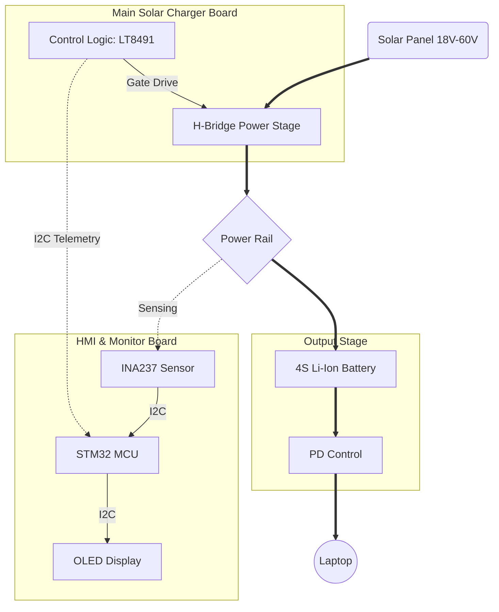

# SunFlow-MPPT-Laptop-Charger/ Solar-to-USB-C Laptop Charger
---

## 🚀 About this Repository
This project started with a practical challenge: I wanted to charge my laptop from a small solar panel that could easily fit into a standard backpack. The goal was to build a compact, reliable setup for autonomous work from any location.

## 💡 Core Concept
* Portability: The entire system is designed to be carried in a laptop bag alongside your devices.
* Efficiency: Powered by the LT8491 controller, the system maximizes energy harvest from portable panels using an advanced MPPT algorithm.
* Current Configuration: Optimized for charging 4S Li-ion battery packs from a 100W folding solar panel (real-world output ~35W).
* Scalability: The H-Bridge hardware design is robust enough to handle full-sized residential panels (420W / 50V) for charging Lead-Acid batteries.
* Roadmap: Currently developing an ultra-light version of this controller for hikers and cyclists.

## 📖 Technical Background
For a deep dive into why you can't just plug a solar panel directly into a laptop, check out my article on LinkedIn:
👉 [Why can't you just plug a solar panel into a laptop?](https://www.linkedin.com/posts/serghei-speian-668629250_why-cant-you-just-plug-a-solar-panel-into-activity-7426272134324322305-SNG3?utm_source=share&utm_medium=member_desktop&rcm=ACoAAD4HanABaPEd2WrWdEWRkD63aSL2CuEYjLA)

## 🛠 System Architecture
The project is a modular "sandwich" assembly consisting of three functional layers:  
* Control Unit: Based on LT8491, handling MPPT algorithms and charging profiles via I2C.  
* Power Stage: A 4-switch H-Bridge Buck-Boost topology for efficient voltage conversion.  
* Smart Monitoring (HMI): Features an STM32 MCU, OLED display, and INA237 (16-bit ADC) for precision sensing and standalone power metering.  

### 📉 System Diagram

    
| System Top View |
| :---: | 
| |

---

### 1. MPPT Charger Power

The power conversion stage responsible for efficient energy transfer from solar panels to batteries.

| Top View | Bottom View |
| :---: | :---: |
|  | |

**Documentation:**

* 📄 [Schematic (PDF)](https://github.com/ssserghei/SunFlow-MPPT-Laptop-Charger/blob/a3bc54ebf10bc31cd3824383045d63d53d4f970b/Solar%20MPPT%20Charger%20Power/Schematic%20Prints/SSS_MPPT_Charger_Power.PDF)
* 🛠️ [Assembly Drawing](https://github.com/ssserghei/SunFlow-MPPT-Laptop-Charger/blob/811f29efc645808a5f0bbe54c9bd5787e2f680a9/Solar%20MPPT%20Charger%20Power/Assembly%20drawing/SSS_MPPT_Charger_Power_Assembly%20drawing.PDF)
* 📋 [Bill of Materials (BOM)](https://github.com/ssserghei/SunFlow-MPPT-Laptop-Charger/blob/811f29efc645808a5f0bbe54c9bd5787e2f680a9/Solar%20MPPT%20Charger%20Power/BOM%20Factory/SSS_MPPT_Charger_Power_BOM.xlsx)

---

### 2. MPPT Charger Control

The logic and control unit that manages the charging profiles, display interface, and communications.

| Top View | Bottom View |
| :---: | :---: |
|  |     |

**Documentation:**

* 📄 [Schematic (PDF)](https://github.com/ssserghei/SunFlow-MPPT-Laptop-Charger/blob/ba2cd1cfb76640df7c12672f7040a9a51f43a725/Solar%20MPPT%20Charger%20Control/Schematic%20Prints/SSS_MPPT_Charger_Control.PDF)
* 🛠️ [Assembly Drawing](https://github.com/ssserghei/SunFlow-MPPT-Laptop-Charger/blob/811f29efc645808a5f0bbe54c9bd5787e2f680a9/Solar%20MPPT%20Charger%20Control/Assembly%20drawing/SSS_MPPT_Charger_Control_Assembly%20drawing.PDF)
* 📋 [Bill of Materials (BOM)](https://github.com/ssserghei/SunFlow-MPPT-Laptop-Charger/blob/ba2cd1cfb76640df7c12672f7040a9a51f43a725/Solar%20MPPT%20Charger%20Control/BOM%20Factory/SSS_MPPT_Charger_Control_BOM.xlsx)

---
### 3. Current Monitoring Tool (Standalone/Integrated)

A high-precision power analyzer based on the **INA237** (16-bit, 85V). It features a unique star-shaped layout with XT-60, USB-A, and USB-C connectors.

| Top View | Bottom View |
| :---: | :---: |
|  |     |

**Documentation:**

* 📄 [Schematic (PDF)](https://github.com/ssserghei/SunFlow-MPPT-Laptop-Charger/blob/7f5d2527201eb6fda3c5b23ebc354246f44d48a7/Solar%20MPPT%20Charger%20Current%20Monitoring%20Tool/Schematic%20Prints/SSS_Current_Monitoring.PDF)
* 🛠️ [Assembly Drawing](https://github.com/ssserghei/SunFlow-MPPT-Laptop-Charger/blob/ba2cd1cfb76640df7c12672f7040a9a51f43a725/Solar%20MPPT%20Charger%20Current%20Monitoring%20Tool/Assembly%20drawing/SSS_Current_Monitoring_Assembly%20drawing.PDF)
* 📋 [Bill of Materials (BOM)](https://github.com/ssserghei/SunFlow-MPPT-Laptop-Charger/blob/ba2cd1cfb76640df7c12672f7040a9a51f43a725/Solar%20MPPT%20Charger%20Current%20Monitoring%20Tool/BOM%20Factory/SSS_Current_Monitoring_BOM.xlsx)
  
---

**🛠 Manufacturing Note:**

Please note that this repository contains documentation only (PDF Schematics, Assembly Drawings, and BOM).
- Gerber Files: Not included in this public preview.
- Source Files: Altium Designer project files are kept private to protect the core intellectual property.
- Note: If you are interested in the full design files, or a technical deep-dive into the LT8491 configuration, feel free to contact me directly via GitHub.

---

**⚠️ Project Status: In Development**

Important: The project is currently in the second prototype design stage and may contain errors or unverified hardware configurations. If you are interested in replicating this design, please wait for the official test results and hardware validation.

---
